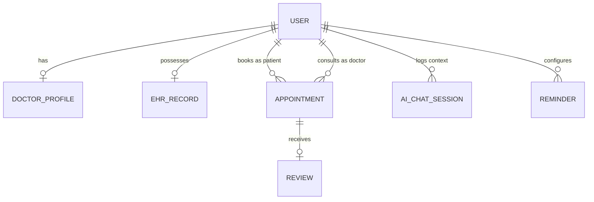

# AegisCare Telemedicine Platform

AegisCare is a production-grade clinical telemedicine system built using the MERN stack (MongoDB, Express, React, Node.js), featuring Socket.io real-time interactions, Razorpay payment gateway integration, Jitsi video consultations, and Google Gemini AI extensions.

---

## 🛠️ System Architecture

The following diagram illustrates the relationship between users, profiles, consultations, schedules, and reminders:



---

## 🚀 Key Production Features

1. **Electronic Health Records (EHR)**: Secure patient clinical summaries editable by patients and toggle-viewable by clinicians during visits.
2. **AI Symptom Checker & Assistant**: Conversational agent backed by Google Gemini featuring persistent history logs and emergency SOS detection warnings.
3. **Multimodal OCR report analyzer**: Converts document scans/reports directly into JSON formats detailing findings and clinical actions.
4. **Active Medicine Reminders**: Configures HH:MM medicine dosage logs triggering Socket connection flashes and SMTP transporter email schedules.
5. **Panic Emergency SOS**: Geolocates users, finds closest seeded Indian trauma centers using Haversine, sends location tracking emails, and catalogs hotlines.
6. **Doctor Live Connectivity**: Broadcasts Online / Offline / Busy indicators in real time via Socket.io channels.
7. **Advanced Search Grid**: Custom lookups compounding specialization, spoken language, city, rates, rating, and years of experience.
8. **Comprehensive Dashboards**: Dynamic demographics layouts (Chart.js), transactional billing tables, and token consumption logs.

---

## 💻 Installation & Setup

### Prerequisites
*   Node.js (v18+)
*   MongoDB (running locally or remote connection string)
*   NPM / Yarn

### 1. Backend Setup
1. Navigate to the backend folder:
   ```bash
   cd backend
   ```
2. Install packages:
   ```bash
   npm install
   ```
3. Configure environment variables in `.env`:
   ```env
   PORT=5001
   MONGO_URI=mongodb://127.0.0.1:27017/telemedicine
   JWT_SECRET=super_secret_jwt_key
   GEMINI_API_KEY=your_gemini_api_token
   ```
4. Run database seed script:
   ```bash
   npm run seed
   ```
5. Start development API gateway:
   ```bash
   npm run dev
   ```

### 2. Frontend Setup
1. Navigate to the frontend folder:
   ```bash
   cd ../frontend
   ```
2. Install packages:
   ```bash
   npm install
   ```
3. Start Vite SPA:
   ```bash
   npm run dev
   ```

---

## 🧪 Testing Suites

Run backend automated Jest & Supertest integration assertions:
```bash
cd backend
npm test
```

---

## 🐳 Docker Orchestration

Build and run all services (MongoDB, Node API Gateway, Nginx SPA) via Docker Compose:
```bash
docker-compose up --build
```
